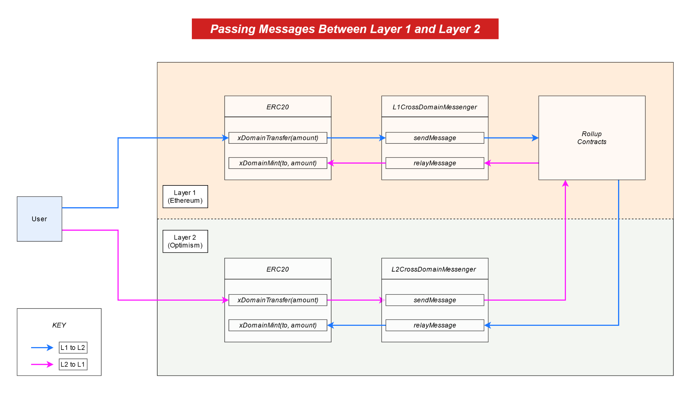

# L1/L2 ERC20 Deposit + Withdrawal Example

Sorry, I haven't had time to fill out this readme fully!
This brief readme will have to do for now.

## Prerequisite Software

- [Git](https://git-scm.com/book/en/v2/Getting-Started-Installing-Git)
- [Node.js](https://nodejs.org/en/download/)
- [Yarn](https://classic.yarnpkg.com/en/docs/install#mac-stable)
- [Docker](https://docs.docker.com/engine/install/)

## Introduction

In this example repository we will walk through how to add L1 <> L2 message passing in your application.

Message passing is automatically done for all Optimistic Ethereum transactions, but retrieving these messages is something that you must implement yourself in your application.
_Message passing_ is used to pass data from L1 to L2 or from L2 to L1.

## L1 <> L2 Communication: Brief Summary

For example, you would pass data from L1 to L2 when initiating a process on L1, and finalizing it on L2, such as an L1 deposit and L2 withdrawal.
The [`L1CrossDomainMessenger`](https://github.com/ethereum-optimism/optimism/blob/master/packages/contracts/contracts/optimistic-ethereum/OVM/bridge/messaging/OVM_L1CrossDomainMessenger.sol) will pass the L1 data to L2 by calling [`sendMessage`](https://github.com/ethereum-optimism/optimism/blob/master/packages/contracts/contracts/optimistic-ethereum/OVM/bridge/messaging/Abs_BaseCrossDomainMessenger.sol#L51-L61).
Then, the [`L2CrossDomainMessenger`](https://github.com/ethereum-optimism/optimism/blob/master/packages/contracts/contracts/optimistic-ethereum/OVM/bridge/messaging/OVM_L2CrossDomainMessenger.sol) calls [`relayMessage`](https://github.com/ethereum-optimism/optimism/blob/master/packages/contracts/contracts/optimistic-ethereum/OVM/bridge/messaging/OVM_L1CrossDomainMessenger.sol#L79-L89) to relay the L1 data back to the receiving user.

Similarly, for an L2 to L1 deposit-withdrawal, message passing would start at the `L2CrossDomainMessenger` calling `sendMessage` and end with the message being relayed by the `L1CrossDomainMessenger` to L1.

This message passing system can be visualized by the diagram below.



For further information, you can review our [documentation on L1 <> L2 Communication on our community hub](https://community.optimism.io/docs/developers/integration.html#%E2%98%8E%EF%B8%8F-l1-l2-communication).

## Message Passing in this Example

In this repository, on [line 97](https://github.com/ethereum-optimism/l1-l2-deposit-withdrawal/blob/main/example.js#L97), we wait for the message to relayed by the `L2CrossDomainMessenger` and use the [`@eth-optimism/watcher`](https://www.npmjs.com/package/@eth-optimism/watcher) to retrieve the hash of message of the previous transaction, a deposit of an ERC20 on L1.

Likewise, on [line 115](https://github.com/ethereum-optimism/l1-l2-deposit-withdrawal/blob/main/example.js#L115), we wait for a second message to be relayed, but this time by the `L1CrossDomainMessenger` so that we can retrieve the message of `tx3`, a withdraw of an ERC20 on L2.

## Running the Example

Run the following commands to get started:

```sh
yarn install
yarn compile
```

Make sure you have the local L1/L2 system running (open a second terminal for this):

```sh
git clone git@github.com:ethereum-optimism/optimism.git
cd optimism
yarn
yarn build
cd ops
docker-compose build
docker-compose up
```

Now run the example file:

```sh
node ./example.js
```

If everything goes well, you should see the following:

```text
Deploying L1 ERC20...
Deploying L2 ERC20...
Deploying L1 ERC20 Gateway...
Initializing L2 ERC20...
Balance on L1: 1234
Balance on L2: 0
Approving tokens for ERC20 gateway...
Depositing tokens into L2 ERC20...
Waiting for deposit to be relayed to L2...
Balance on L1: 0
Balance on L2: 1234
Withdrawing tokens back to L1 ERC20...
Waiting for withdrawal to be relayed to L1...
Balance on L1: 1234
Balance on L2: 0
```
